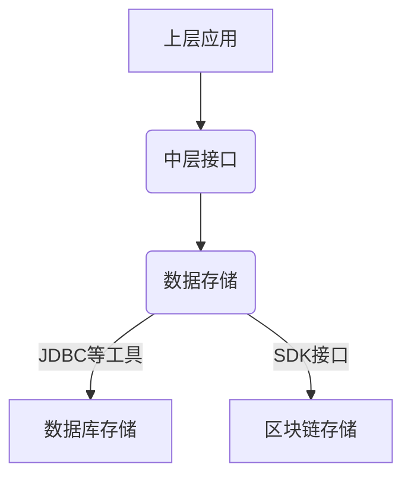
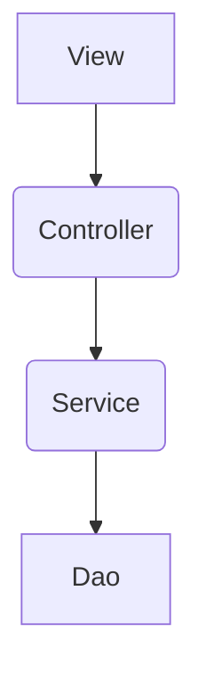
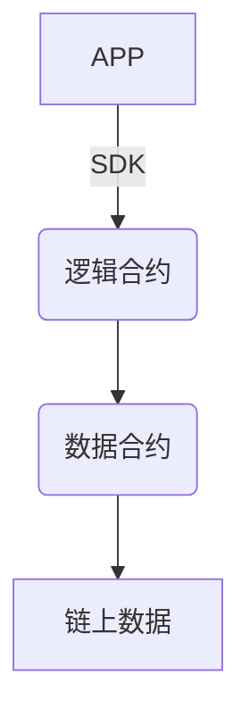

# 网易云课堂-区块链应用工程师微专业-应用实战项目集
## 作业一：主观题
* 问题：**请简单描述一个区块链项目的完整流程？可以举课程中的例子进行说明，也可以从一般业务项目角度展开说明**。尽量写的详细一下，如果内容较多，可以上传附件
* 解题提示：**从业务需求到合约，从系统构建到服务提供，描述要有层次，结构要清晰**
- 此处以作业中提出的**投票系统**为例进行阐述，但不局限于作业的需求，以结合学习生活的实际情况进行阐述

***

### 1. 应用背景介绍

投票系统在生活、学习、工作中均很常见，且拥有诸如统计调查等多种变化形态。此处集中讨论记名投票或其应用形式，在进行了某主题或者讨论的表决时，常常需要反映或记录一整个表决的过程，不考虑不记名投票的形式（不记名投票不适合应用于区块链项目，不符合可溯源的特点），例如应用在项目会议中——从提出观点，对观点进行投票赞成与否，到决定根据投票结果决定项目进展的方向以及主要的人员及分工，均可使用“投票表决”的形式进行整个过程的记录

### 2. 业务需求分析

以学习生活中遇到过的实际情况为例，老师布置课题，要求学生分组，每组自定题，完成项目，并记录项目过程

首先，学生分组完全可以通过——想当项目组长的同学发起投票，欲参加的组员参与投票——这样的形式进行并完成分组

然后，小组选题依然可以通过——成员发起投票，其他成员投票赞成——来参与并确定项目选题

再者，小组分工仍然可以通过——功能块带领者发起投票，欲参与者参与投票——来确定是否参与某功能块的设计/开发

那么，综上情况可进行归纳在这样需求的情况下需要需要包含的功能至少有如下功能：

①可设定课程人数

②选定课程人数范围内可发起投票，可参与投票，选票至少包含**赞成/否定**两种状态

③发起投票时可确定投票主题，并进行描述（如包含项目选题内容、分组分块功能的职责等信息）

④能够确定投票结束，给出投票结果

### 3. 原系统设计及业务痛点分析

#### 3.1 关键业务流程分析

分组：开始分组→发起分组投票→参与分组投票→查看投票结果

选题：开始选题→发起选题投票→参与选题投票→查看投票结果

选模块等关键业务与上述流程相仿，可沿用相同的设计

#### 3.2 功能介绍

核心功能应当如此：确定主题→发起该主题的投票→参与该主题的投票→查看投票结果

### 4. 引入区块链技术带来的优势

很明显，在核心功能带领的一整条主线中都是由该投票发起者进行信息的汇总，参与者需保留自己参选某主题的票根作为证据来证明他是参与到对应主题中的讨论中去的，或是在工作出现异常时需要问责的。

这个时候区块链技术中可溯源的特性就得到了充分体现，在不可修改性的支持下，每一项工作的安排/参与，均可在系统中保证记录不被修改，那么项目的贡献度和问责机制无疑会得到极大展现。

### 5. 区块链系统设计

#### 5.1 总体架构设计
可参考的设计思路：上层应用↔中层接口调用↔下层数据存储，与普通web项目的区别重点体现在接口调用到数据存储部分：

#### 5.2 应用架构设计
可参考MVC架构等进行设计，主体与网站项目相仿，但是需要考虑区块链技术的交互特性，如在展示不可修改的特性时，需要考虑由底层区块链的特性，由下而上的反应数据的不可修改，需要与原先数据库交互的方式有所变动。基本思路可参考：

#### 5.3 智能合约设计

可参考的设计思路：上层应用↔逻辑合约↔数据合约，需处理好合约中的“分层”设计

#### 5.4 业务逻辑实现

上层应用中业务逻辑的处理需要根据具体业务进行分析，主要分为两大主线：调用到链数据的，没有调用到链数据的

由于链上数据修改读取的代价相对较大，在进行业务逻辑的设计时需要尽可能考虑一块功能中集中的、一次性的调用，而不是多次分片调用链上数据

### 6. 系统部署

#### 6.1链部署

可选择自行部署超级账本提供的网络，或者直接使用hyperchain等已经在运作中的链

#### 6.2合约部署

在链网络中部署完成设计的合约

#### 6.3应用部署

部署应用(网站或开启服务等)，如在阿里云或腾讯云等服务器上部署JavaWeb应用

----

至此，一个大体上的区块链应用项目的完整流程便基本成型了，当然，具体细节需要根据项目实际情况进行具体化的描述。可考虑尝试此过程于课题小组或毕业设计。

