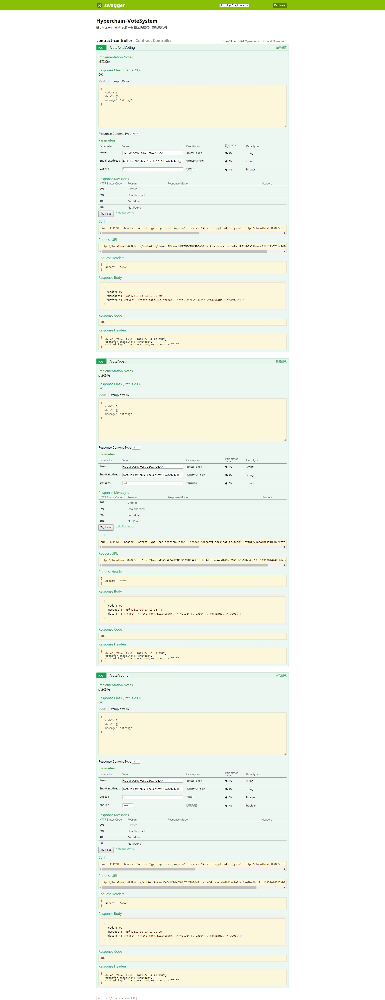

# VoteSystem

## 项目介绍

> 网易云课堂微专业-区块链开发工程师-应用实战项目集

### 主要功能

1. 发布投票(所有人)
2. 参与投票(所有人)
  - 实现方案：记名投票，保存参与投票者的地址，可用于后期追溯或进行问题调查
3. 结束投票(发布者)
4. 验证投票结果(内部函数)
  - 当系统内超过2/3的人参与投票且1/2以上的投了赞成票，则投票确认，否则投票否决。

### 原需求 

部署一个智能合约，合约功能是简单的投票系统，可以发布投票，所有人都可以参与投票，当系统内超过3/2的人参与投票且1/2以上的投了赞成票，则投票确认，否则投票否决。
以 restful api 形式，项目添加图形界面展示，能够通过区块链账户进行投票。

---

#### 运行结果

执行顺序：postVote -> voting -> endVoting

返回值分别为3300, 3300, 3402, 即为操作正常, 操作正常, 投票通过

---

